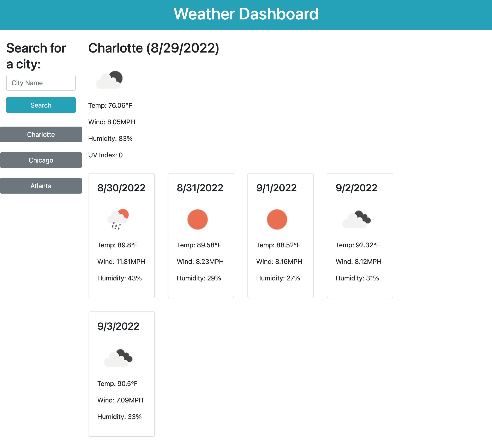

# Weather Dashboard Project

## Table of Contents
[Description](#description)

[Visuals](#visuals)

## Description

The weather dashboard application is a fully functional weather app that uses the OpenWeather API to retrieve weather information for whatever city you search for. Upon opening, if you have any previous searches from your last time using the app, the left side of the screen will be populated with buttons to make it easy to renavigate to past searches. Upon searching for a new city, the current weather data is displayed with an icon as well as other pertinent weather data. A five-day forecast will also be displayed, with the dates and similar weather info to the current data. All searches are saved in local storage so that at any time, you can return to the page and pick up where you left off.

## Visuals

